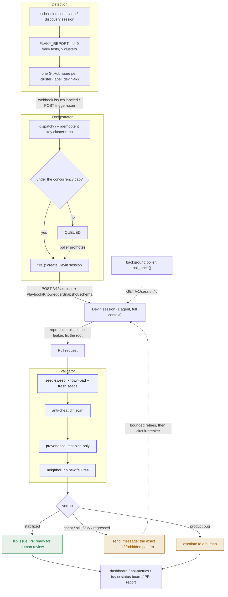

# Architecture: how the harness actually functions

This is the real structure of the system -- the modules, the control flow, and a
walkthrough of one remediation end to end (the dataset-import cluster -> PR #6),
which is the one thread that has run *fully real*: real Devin fix, real
independent verification on local compute.

## The harness

## Components

| Module | Responsibility |
|--------|----------------|
| `clusters.py` | The 5 real flaky clusters (target tests, known-bad seeds, root cause, leaker, fix) -- from a real discovery session (`FLAKY_REPORT.md`). |
| `devin_client.py` | Devin v1 API: `POST /v1/sessions` (with `playbook_id` / `knowledge_ids` / `snapshot_id` / `structured_output_schema` / `session_secrets`), `GET /v1/session/{id}`, `POST .../message`. Mock mode mirrors it. |
| `github_client.py` | GitHub REST: file issues, comment, labels, read PR diff / files / check-runs. |
| `prompts.py` | The anti-cheat-hardened dispatch prompt + the self-correction follow-up. |
| `validator.py` | The differentiator: seed-sweep + anti-cheat diff scan + provenance + neighbor -> typed verdict. |
| `orchestrator.py` | The closed loop: `dispatch` (idempotent, bounded concurrency), `poll_once`, route, bounded feedback, escalate. |
| `live.py` | Live pulls of real session status from the Devin API; fast gates on open PRs. |
| `approaches.py` | The head-to-head: alternatives judged by the same validator. |
| `main.py` | FastAPI: `/webhook/github`, `/trigger/scan`, `/dashboard`, `/api/*`, background poller. |
| `db.py` / `models.py` / `events.py` | SQLite persistence, the `Remediation`/`Verdict` model, the event log + metrics. |

## How it functions in practice -- one real remediation (PR #6)

1. **Detect.** A real Devin discovery session ran `tests/unit_tests/` across seed
   orderings; `test_import_column_allowed_data_url` passed in default order and
   failed under reordering -> recorded as the `dataset-import-allowlist` cluster.
2. **File + trigger.** `seed_issues.py` opened issue #2 with the `devin-fix` label.
   Labeling (or `POST /trigger/scan`) calls `orchestrator.dispatch()`, which is
   idempotent on `dataset-import-allowlist:catherineyinzhao/superset` and, under
   the concurrency cap, fires a Devin session.
3. **Remediate (real Devin work).** Session
   [`6bfe49c8...`](https://app.devin.ai/sessions/6bfe49c86c4e46b7a5d3c09c3ece3ba9)
   reproduced the failure under seeds 202/303/404, **bisected to the leaking
   predecessor** (`test_validate_data_uri` mutated
   `app.config["DATASET_IMPORT_ALLOWED_DATA_URLS"]` and never restored it), and
   fixed it by wrapping the mutation in `try/finally`.
4. **PR.** The session was push-blocked (no GitHub-app write access), so its
   verified diff was extracted and opened as
   [PR #6](https://github.com/catherineyinzhao/superset/pull/6). (With the Devin
   GitHub app authorized, the session opens the PR itself via `session_secrets`.)
5. **Verify independently (real, local compute, no ACU).** `validator.py` against
   a fresh clone of the PR branch:
   - **anti-cheat diff scan** -> no `skip`/`@flaky`/`retry`/`sleep` (pass);
   - **provenance** -> only the test file changed (pass);
   - **seed-sweep** (`scripts/local_seed_sweep.py`, module scope -- the leaker is
     co-located): the flake **reproduced on the pre-fix file** under seeds
     202/303/404, and the PR branch showed **0/9 target failures** (baseline + 3
     known-bad + 5 fresh).
   -> verdict **`stabilized`**.
6. **Route + observe.** Issue #2 -> stabilized; the validator report is posted on
   PR #6; the dashboard shows the verified card with the real seed evidence.

## Control-loop mechanics

- **Idempotency + bounded concurrency.** `dispatch()` is keyed on `cluster:repo`
  (a webhook retry never double-fires); excess dispatches are `QUEUED` and the
  poller promotes them as capacity frees -- so a large scan cannot fan out into
  many simultaneous full-suite runs (the way to burn an ACU budget).
- **The poller** (`poll_once`, a background thread) reconciles every active
  session: `running` -> wait; `blocked` -> comment/keep; `finished` -> validate;
  `finished` without a PR -> escalate.
- **The validator never trusts CI or the agent.** It re-derives every verdict
  from a fresh checkout. The seed-sweep is statistical (known-bad orderings prove
  the regression is closed; fresh orderings prove it generalizes).
- **Feedback is bounded + externally grounded.** A `cheat`/`still-flaky`/
  `regressed` verdict sends the *exact* evidence back to the same session and
  retries up to `MAX_CORRECTION_ROUNDS`; then a circuit-breaker escalates.
- **Escalation is first-class.** A product bug (provenance touched `superset/`)
  routes to a human rather than being masked.

## What ran for real vs. deferred

- **Real:** the 5 issues; 5 Devin sessions (created, polled, one unblocked via
  `message`); PR #6 (a genuine Devin root-cause fix); the anti-cheat + provenance
  gates; the **seed-sweep verification of PR #6 on local compute** (before/after);
  the live session-status strip (pulled from the Devin API).
- **Deferred / demo:** the four other clusters are push-blocked (only the
  GitHub-app authorization is missing -- not capability); the full multi-cluster
  arc (cheat caught -> retried -> stabilized, escalation) is shown deterministically
  in mock mode (`docs/dashboard-demo.html`).
